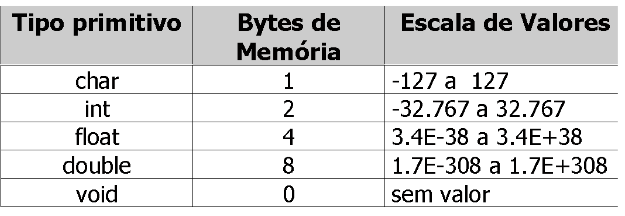
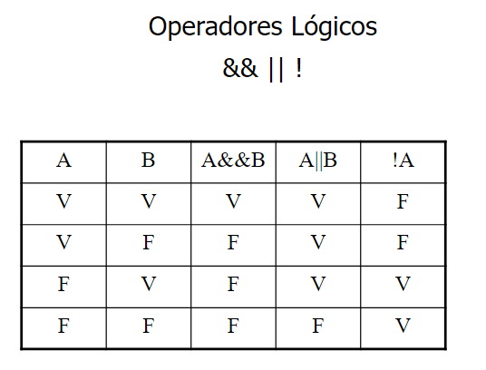
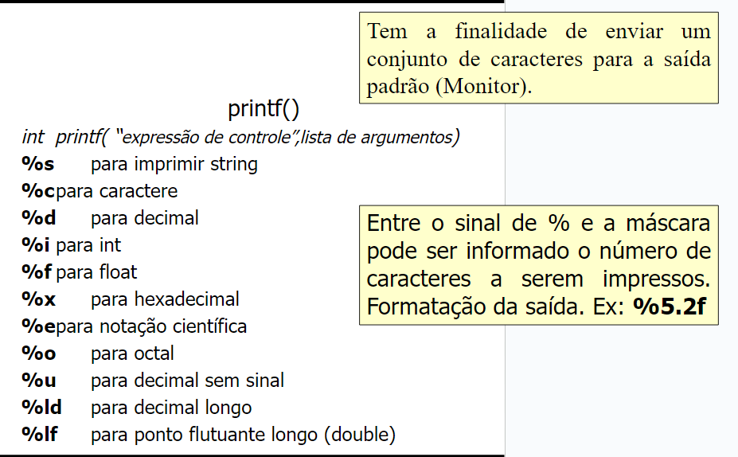
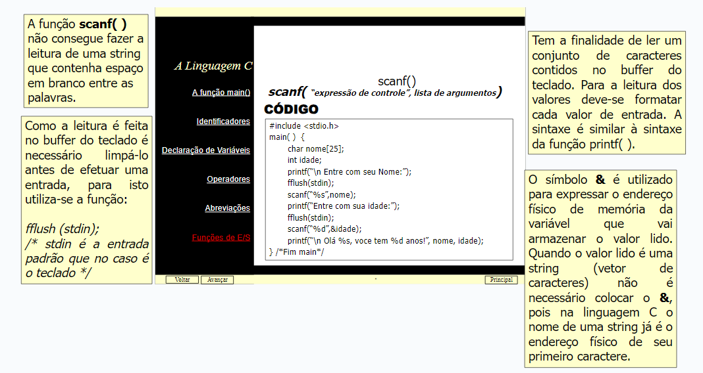

**a + = b ** \*\*o mesmo que a = a + b

a - = b\*\* \*\*o mesmo que a = a - b

a _ = b\*\* \*\*o mesmo que a = a _ b

a / = b \*\* \*\*o mesmo que a = a / b

a %= b\*\* \*\*o mesmo que a = a % b

a + = 3\*\* **o mesmo que a = a + 3**

