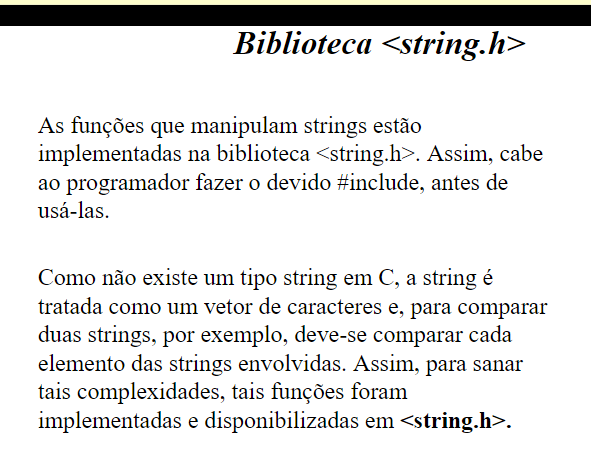
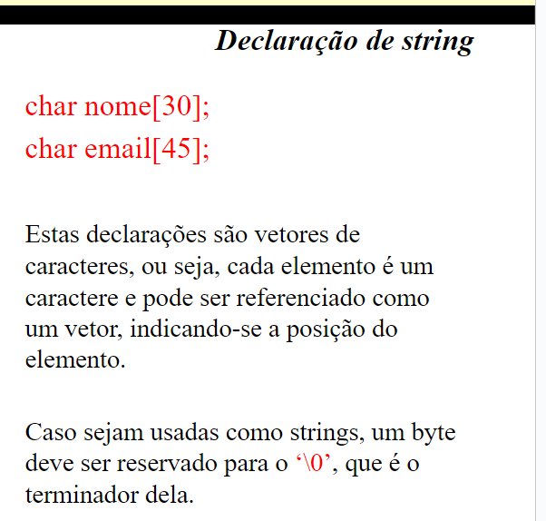
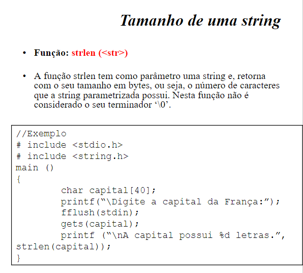
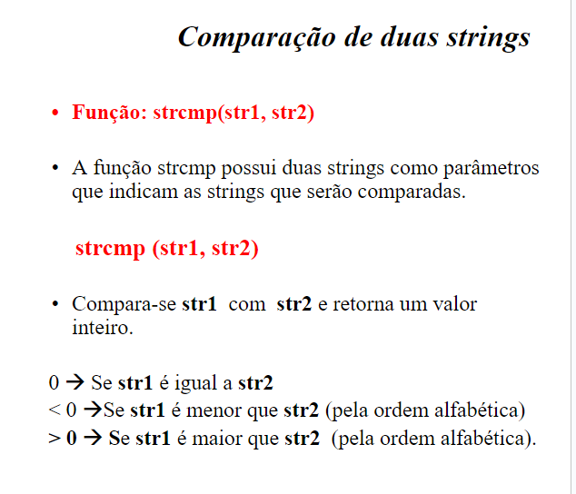
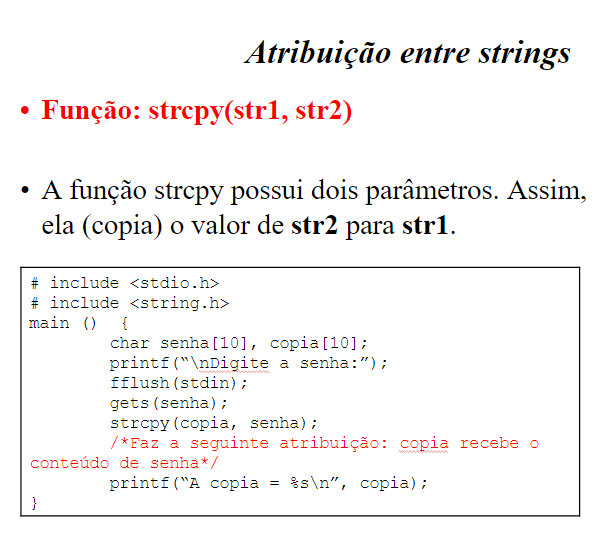
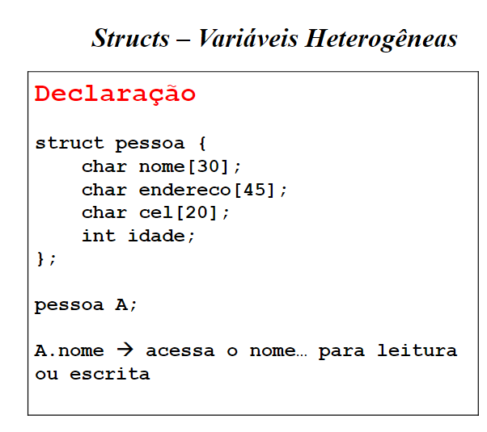
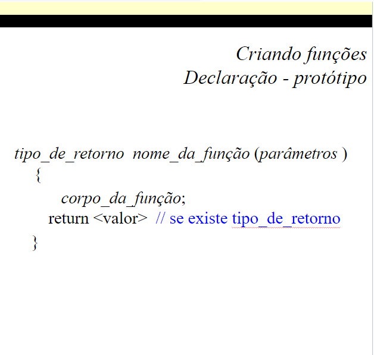
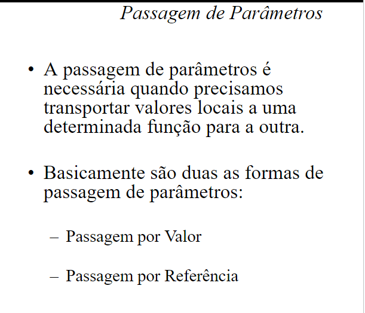
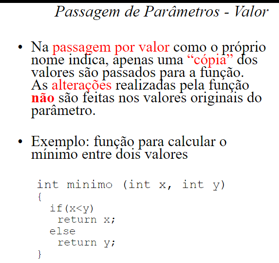
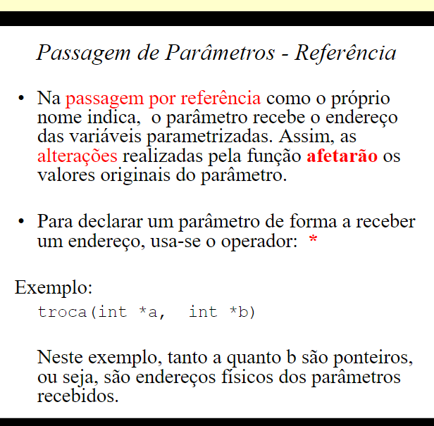

sor Maurício vazou.. 27/02

matrizes e vetores

declarar string

biblioteca string

length string

comparação strings

atribuir valor de uma string noutra

structs - variáveis heterogêneas

declarando outras funções (se não definir tipo de retorno de função o padrão é int)

passando parâmetros para funções

parâmetro por valor

parâmetro por endereço

"
