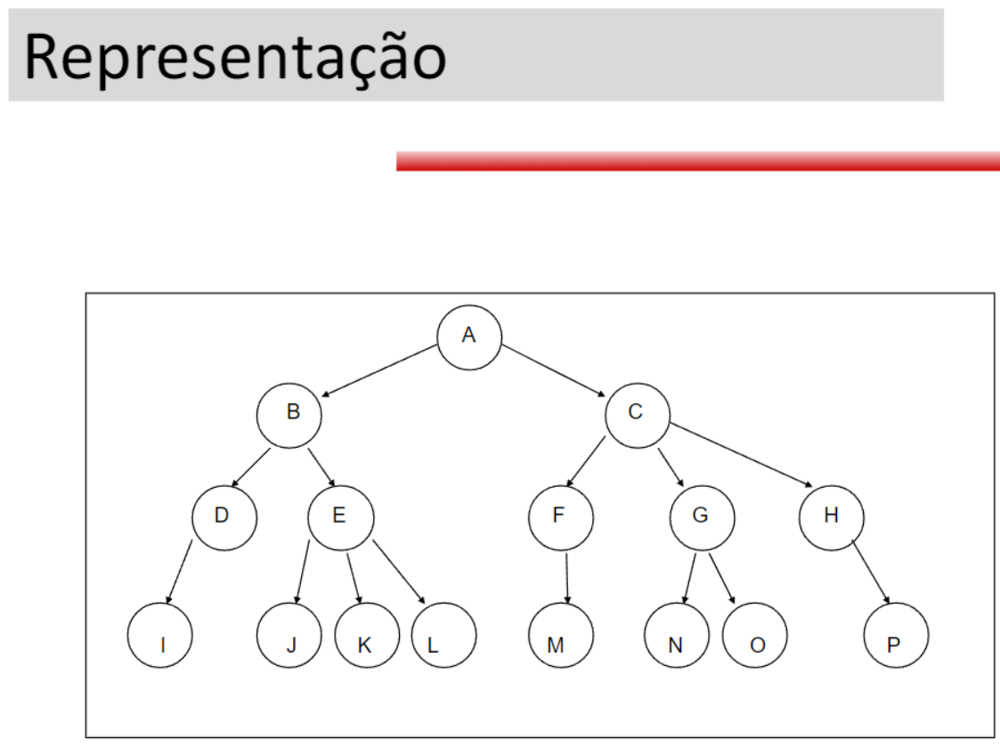
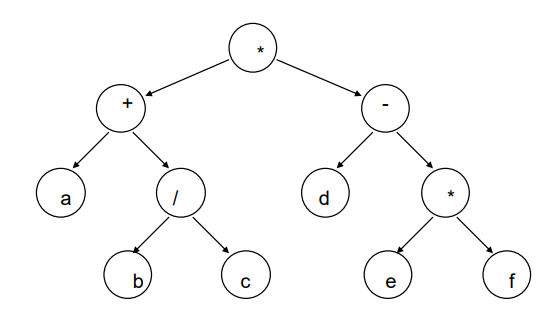
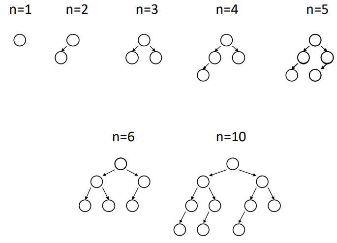

# 07/05/2024 - Árvores

* Terminologias:
  * RAIZ: é o nó que está no topo da árvore. Na árvore acima é o nó que contém a informação 'A'
  * DESCENDENTES: são os nós que estão ligados abaixo de um nó específico.
  * DESCENDENTES DIRETOS: são os nós que estão ligados diretamente ao nó de nível superior.
  * ALTURA DA ÁRVORE: é o máximo nível de uma árvore.
  * NÍVEL DE UM NÓ: é a distância que o separa da raiz. A raiz tem nível = 0.
  * FOLHA: são os nós que não possuem descendentes.
  * GRAU DE UM NÓ: é o número de descendentes diretos.
  * GRAU DE UMA ÁRVORE: é o máximo grau de seus nós.

* ( a + b / c ) * ( d - e * f )
* Terminologias
  * Se A é a raiz de uma árvore binária e B é a raiz de sua sub-árvore esquerda ou direita, então diz-se que A é o pai de B e que B é o filho direito ou esquerdo de A.
  * Um nó sem filhos é chamado de folha.
  * Dois nós são irmãos se forem filhos direito e esquerdo do mesmo pai.
  * Se todo nó que não é folha numa árvore binária tiver sub-árvores esquerda e direita não vazias, a árvore será considerada árvor estritamente binária.
  * No exemplo citado, tem-se uma árvore estritamente binária.
  * Uma árvore binária completa de profundidade (altura) d é a árvore estritamente binária em que todas as folhas estejam no mesmo nível d.
  * Uma árvore é dita perfeitamente balanceada se para cada nó da árvore, o número de nós em suas subárvores à esquerda e à direita diferirem de no máximo 1 nó.
* Árvore perfeitamente balanceada
  * Construir uma árvore com N elementos é vago, pois não especifica a posição dos nós (podem ser geradas diversas árvores distintas) . Se especificarmos : a construção de uma árvore com altura (profundidade) mínima H, poderíamos construí-la de acordo com o esquema a seguir. Seja N o número de nós da árvore, então:
  * 

Base em cpp no arquivo base.cpp
