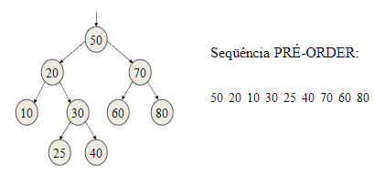
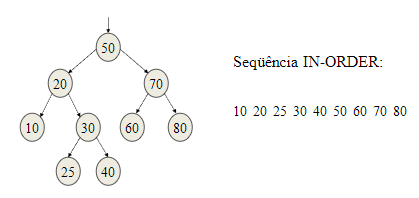
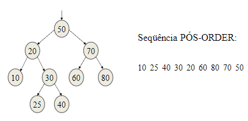
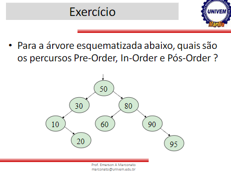

# 14/05/2024 - Percurssos em Árvores Binárias

* 3 Percurssos pra acessar dados em árvores binárias:

  * Pré-Order
  * In_Order
  * Pós-Order
* Cada nó deve ser visitado apenas uma vez, recursivamente.
* Pré-Order:

  * Visita a raiz R
  * Visita L em pré-order
  * Visita R em pré-order
    * 
    * ```cpp
      void Pre_Order(ARVORE*R)
      {
          if(R!=NULL)
          {
              printf("%i",R->info);
              Pre_Order(R->esq);
              Pre_Order(R->dir);
          }
      }
      ```
* In-Order:

  * Visita L em In-Order
  * Visita a Raíz RT
  * Visita R em In-Order
    * 
    * ```cpp
      void In_Order(ARVORE*R)
      {
          if(R!=NULL)
          {
              In_Order(R->esq);
              printf("%i",R->info);
              In_Order(R->dir);
          }
      }
      ```
* Pós-Order:

  * Visita L em Pós-Order
  * Visita R em Pós-Order
  * Visita a Raíz RT
    * 
    * ```cpp
      void Pos_Order(ARVORE*R)
      {
          if(R!=NULL)
          {
              Pos_Order(R->esq);
              Pos_Order(R->dir);
              printf("%i",R->info);
          }
      }
      ```



* Pré-order: 50 - 30 - 10 - 20 - 80 - 60 - 90 - 95
* In-order: 10 - 20 - 30 - 60 - 50 - 80 - 90 - 95
* Pós-order: 10 - 20 - 30 - 60 - 95 - 90 - 80 - 50
