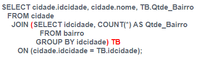
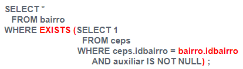
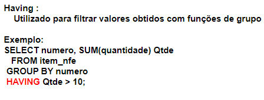
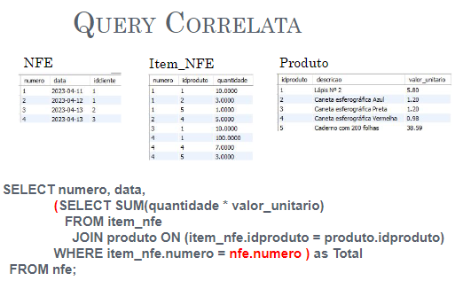

# 16/05/2024 - Aula 13

* IN (1, 2, 3, 4, 5) -> da pra fazer subquerry dentro do in, where, exists, parênteses:
* 
* 
* 
* 
  * tem que usar para funções de agrupamento, n da pra usar o where
* 
* funcionarios - dependentes dos funcionários
