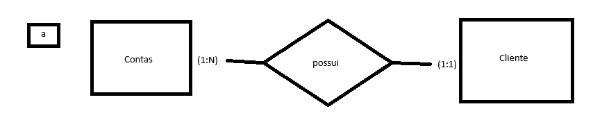
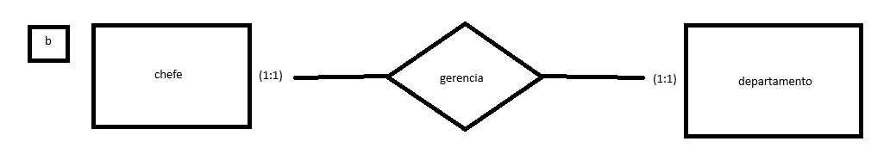
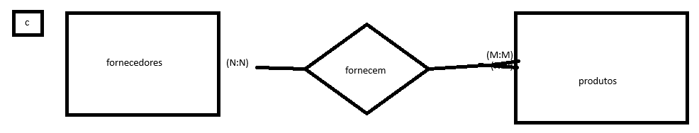
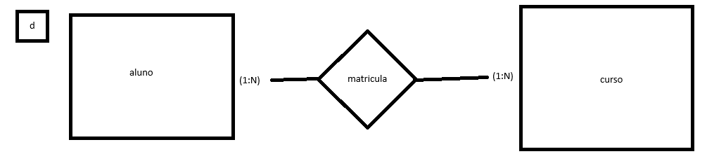

# 29/02/2024 - Cardinalidade, DED (Diagrama de Estrutura de Dados), Normalização dos diagramas

- **Cardinalidade:**
  - Definição do máximo de ocorrências de um relacionamento;
  - Para ser determinada deve-se fazer a pergunta relativa ao relacionamento em ambas as direções, ex:
    - Um departamento pode ter várias pessoas, já uma pessoa pode ter apenas um departamento.
  - Restrição de Cardinalidade: DEPARTAMENTO (1:1) -> POSSUI <- (1:N) EMPREGADO
    - É uma notação que mostra o mínimo e máximo de relações entre registros de entidades.

* Notação do James Martin / Engnharia da Informação:

  - N -> pé de galinha -> 3 riscos
  - 1 -> 1 risco
  - Opcional -> O
  - Obrigatório -> |

> | | -> Mínimo 1 Máximo 1
>
> | N -> Mínimo 1 Máximo N
>
> O N -> Mínimo 0 Máximo N
>
> O I -> Mínimo 0 Máximo 1

## Ex1 - Faça a representação gráfica usando o modelo de entidades e relacionamentos. Analise as afirmações abaixo e identifique os tipos de relacionamentos.

a) Contas correntes pertencem a um cliente

b) Um chefe gerencia um departamento

c) Vários Fornecedores fornecem inúmeros produtos

d) O aluno matricula-se em um curso

> _RISCO TRACEJADO = LOSANGO (É O RELACIONAMENTO, MESMA COISA)_
>
> _N PRA M GERA OUTRA TABELA COM ID ÚNICO EM CADA REGISTRO_

- **Diagrama de Estrutura de Dados (DED)**
- Tradução do MER num formato mais próximo do formato físico
- Regras para formação das estruturas de dados:

  - 1.Entidade no MER se transforma em Estrutura no DED, com os mesmos atributos;
  - 2.Um relacionamento (1:N) no MER é representado por uma seta no DER (1 -> N) indo de 1 para N. A entidade que é N recebe + 1 atributo, o ID;
  - 3.Um (N:M) no MER (Fornecedor N -- Fornecimento -- M Produto) se transforma em (Fornecedor -> Fornecimento <- Produto) no DED
  - 4.não anotei, mas é algo relacionado a uma tabela que se relaciona com ela mesmo
  - 5.não anotei, mas acho que é algo relacionado a uma tabela de relacionamento que cria uma outra tabela de relacionamento

## Tentando modelar um banco:

Requisitos:

- O sistema deve emitir nota fiscal;
- A nota fiscal possui número, data, cpfCliente, nomeCliente, endereçoCliente;
- A nota fiscal possui uma relação de produtos: nome, quantidade, valorUnitário e valorTotal.

## Ex2 - Faça a representação gráfica usando o modelo de entidades e relacionamentos. Analise as afirmações abaixo e identifique os tipos de relacionamentos. Acrescente a cardinalidade dos relacionamentos com restrições. (Entregar no Teams)

a) Várias notas fiscais possuem vários produtos

b) Vários alunos participam de várias disciplinas

c) Vários colaboradores trabalham em um departamento

d) Um país é formado por várias unidades federativas e vários municípios pertencem a uma unidade federativa
