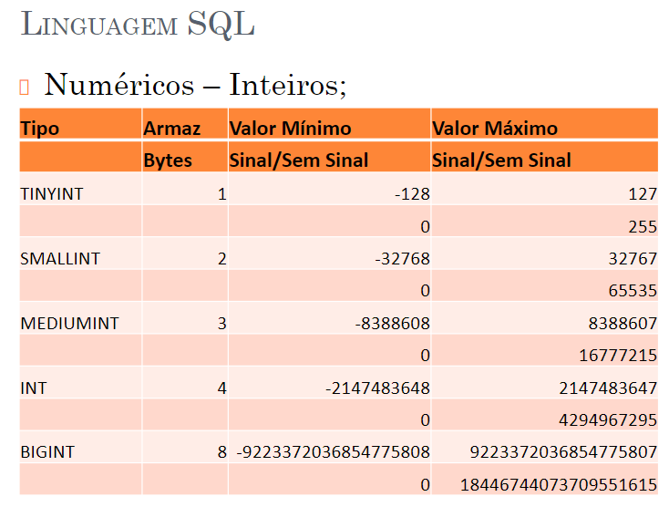

# 21/03/2024 - Aula 6 - Começando com o SQL 😬

##### SQL ( Structured Query Language, ou Linguagem de Consulta Estruturada)

* É uma linguagem de pesquisa declarativa para Bancos de Dados Relacionais;
* Desenvolvida originalmente no início dos anos 70 nos laboratórios da IBM em San Jose, dentro do projeto System R;
* O objetivo era demonstrar a viabilidade da implementação do modelo relacional proposto por E. F. Codd;
* O nome original da linguagem era SEQUEL, acrônimo para "Structured English Query Language";
* Imaginavam que o pessoal de cargo de alto nível gerencial conseguiria fazer suas consultas.
* **Data Definition Language (DDL) utilizada para definir a estrutura do banco de dados:**

  * CREATE – cria objetos no banco de dados;
  * ALTER – altera a estrutura de objetos no banco de dados;
  * DROP – deleta objetos do banco de dados;
  * COMMENT – adiciona comentários ao dicionário de dados.
* **Data Manipulation Language (DML) declarações que manipulam os dados:**

  * INSERT – insere dados em uma tabela;
  * UPDATE – altera dados existentes em uma tabela;
  * DELETE – deleta registros em uma tabela;
* **Data Query Language (DQL) declarações que consultam os dados:**

  * SELECT – recupera dados da banco de dados;
* **Data Control Language (DCL):**

  * GRANT – concede privilégios aos usuários;
  * REVOKE – retira os privilégios dos usuários.
* **Data Transaction Language (DTL):**

  * BEGIN TRANSACTION (  ou begin work ) – início de uma transação;
  * COMMIT – finaliza uma transação, persistindo os dados no banco de dados;
  * ROLLBACK – descarta todas as alteração realizadas após um COMMIT ou BEGIN TRANSACTION.
* **Criação de tabela no Banco de Dados Mysql (DDL):**

  * CREATE DATABASE aula01 ou;
  * CREATE SCHEMA aula01; ( versão 8 e posterior);
  * Após a criação deve-se selecionar o Banco de Dados:
    * USE aula01;
  * CREATE TABLE ...
* **Tipos de Dados do Mysql (mais comuns):**

  * Numéricos:
    * Decimal:
      * O tipo NUMBER no Mysql é representado por DECIMAL;
      * Formato: DECIMAL(M,D), onde M é a precisão e D a escala;
      * O valor defaults são M = 10 e D = 0;
      * O Valor máximo de dígitos é 65.
    * Float:
      * FLOAT, REAL DOUBLE são tipos numéricos utilizados para armazenar ponto flutuante;
      * Formato: FLOAT(M,D), onde M é a precisão e D a escala.
  * Data e hora:
    * Tipo: Date – Data no formato 'YYYY-MM-DD'
    * Intervalo válido: '1000-01-01' até '9999-12-31'
    * Tipo: Datetime – Data e hora no formato 'YYYY-MM-DD HH:MI:SS'
    * Intervalo válidos: '1000-01-01 00:00:00' até '9999-12-31 23:59:59'
  * String:
    * Tipo: CHAR – Caracter de tamanho fixo > Precisão de 0 a 255;
    * Tipo: VARCHAR – Caracter de tamanho variável > Precisão de 0 a 65.535;
    * Tipo: BLOB – Binary Large Object – 65535 caracteres > Precisão: 4294967295 caracteres (BIGBLOB);
    * Tipo: TEXT – 65535 caracteres > Precisão: 4294967295 caracteres (BIGTEXT).
* **Constraint:**

  * Chave Primária -> Primary Key;
  * Chave Estrangeira -> Foreign Key;
  * Check Constraint.
* **EXEMPLO DE CRIAÇÃO DE TABELA:**

```sql
CREATE TABLE departamento (
codigo INT UNSIGNED NOT NULL,
descricao VARCHAR(50) NOT NULL,
CONSTRAINT pk_departamento PRIMARY KEY (codigo));

OBS: UNSIGNED (sem sinal) – significa que serão aceitos somente valores positivos, no caso de 0 até 4294967295, vide slide 11.
```

```sql
CREATE TABLE funcionario (
id INT NOT NULL,
nome VARCHAR(80) NOT NULL,
sexo CHAR(1) NULL,
nascimento DATE NULL,
salario DECIMAL(8,2) NULL,
cod_depto INT UNSIGNED NOT NULL,
CONSTRAINT pk_funcionario PRIMARY KEY (id),
CONSTRAINT chk_salario CHECK(salario > 0),
CONSTRAINT fk_departamento FOREIGN KEY (cod_depto) REFERENCES departamento (codigo)
);
```

* **EXEMPLO DE ALTERAÇÃO:**

```sql
ALTER TABLE departamento ADD COLUMN telefone VARCHAR(15) NULL;
```


WAMP -> APACHE, MYSQL e PHP



