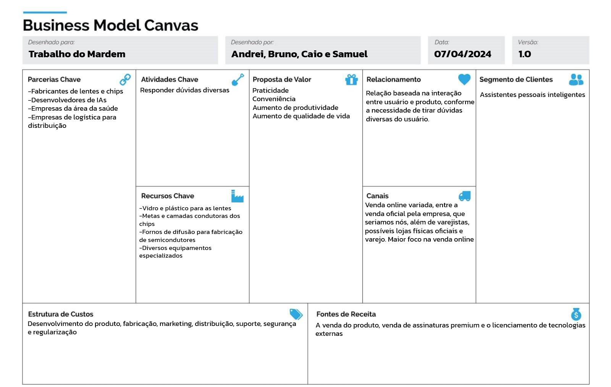

# Descrição:

* O produto seria a união de um chip implantado no usuário e uma lente em seu olho, serviria como um assistente pessoal que leria sua mente e transmitiria a resposta para o olho.

## Detalhamento, Funcionamento e Características importantes:

* O sistema seria capaz de ler os pensamentos do usuário e exibir as respostas diretamente em sua visão.

## O que é o BMG Canvas, qual sua importância e sua finalidade?

* BMG Canvas é um modelo de negócios que ajuda a visualizar a idealização de um produto e mapeá-lo dentro de diversas esferas do seu desenvolvimento, valores, fontes de renda, parcerias, etc..

## Porque aprendermos sobre o modelo BMG Canvas no curso de Tecnologia?

* Pois ele nos ajuda a estruturar um suposto produto que possamos a fazer, deixar uma ideia mais madura para conseguirmos avaliar e reestruturar um suposto projeto de produto.

## Segundo o modelo Canvas:

* Qual o segmento que o produto atende?

  * Assistentes pessoais inteligentes
* Qual o relacionamento entre o cliente e produto?

  * É uma relação direta baseada na interação entre usuário e produto, conforme as necessiades diversas do usuário
* Quais os canais de venda entre o produto e o cliente?

  * Venda online variada, entre a venda oficial pela empresa, que seria nossa, varejistas, parcerias com lojas físicas.. e por aí vai. O maior foco seria na venda online.
* Quais os valores do produto?

  * Praticidade, conveniência, aumento da produtividade e qualidade de vida do usuário em qualquer âmbito
* Quais as principais atividades do produto?

  * Responder dúvidas
* Quais são os recursos necessários para vender o produto?

  * Pesquisa e desenvolvimento do produto e marketing e vendas para comercialização
* Quais são os principais parceiros que serão necessários para vender o produto?

  * Os fabricantes de lentes e chips, os precurssores no estudo e desenvolvimento de IAs, empresas farmacêuticas e empresas de logística para distribuição
* Quais são os custos do produto?

  * Desenvolvimento do produto, fabrição, marketin, distribuilçao, suporte, segurança e regularização
* Quais serão as fontes de receita do produto?

  * A venda do produto, venda de assinaturas premium e licenciamento de tecnologias externas

###### Grupo

* Andrei Santos de Oliveira
* Bruno Marques Freitas
* Caio Issao de Barros Fujisawa
* Samuel Pereira Barreto
