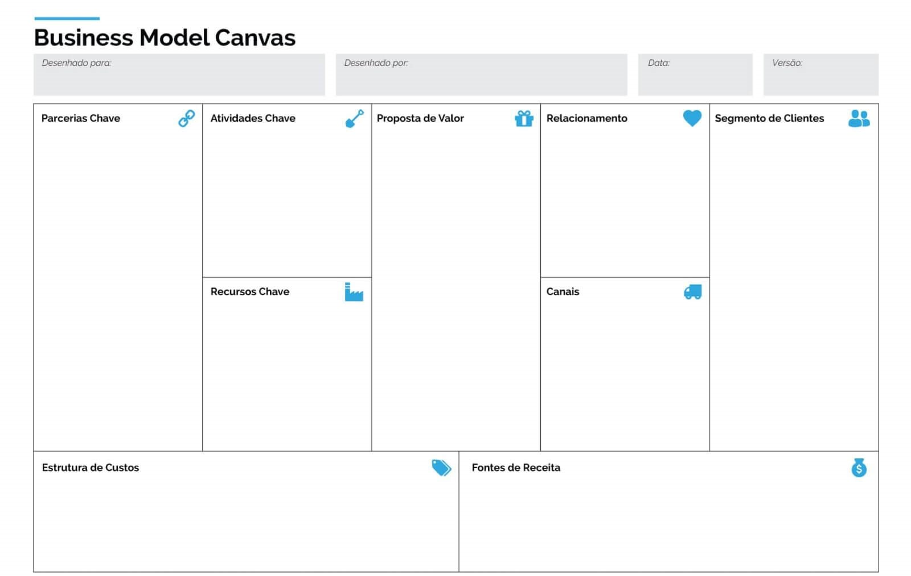

# Descrição:

* O produto seria a união de um chip implantado no usuário e uma lente em seu olho, serviria como um assistente pessoal que leria sua mente e transmitiria a resposta para o olho.

## Detalhamento, Funcionamento e Características importantes:

* R

## O que é o BMG Canvas, qual sua importância e sua finalidade?

* R

## Porque aprendermos sobre o modelo BMG Canvas no curso de Tecnologia?

* R

## Segundo o modelo Canvas:

* Qual o segmento que o produto atende?

  * R
* Qual o relacionamento entre o cliente e produto?

  * R
* Quais os canais de venda entre o produto e o cliente?

  * R
* Quais os valores do produto?

  * R
* Quais as principais atividades do produto?

  * R
* Quais são os recursos necessários para vender o produto?

  * R
* Quais são os principais parceiros que serão necessários para vender o produto?

  * R
* Quais são os custos do produto?

  * R
* Quais serão as fontes de receita do produto?

  * R

###### Grupo

* Andrei Santos de Oliveira
* Bruno Marques Freitas
* Caio Issao de Barros Fujisawa
* Samuel Pereira Barreto
