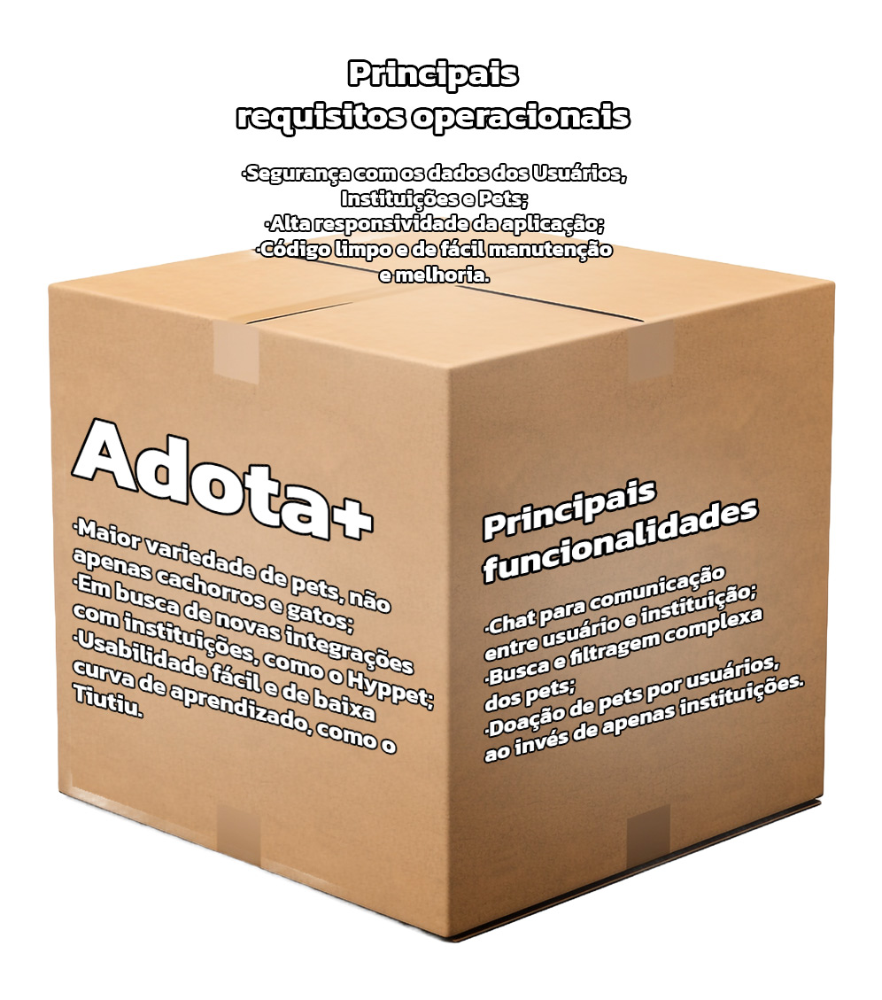

# Adota+

* Problema que resolve: Necessidade de ir presencialmente em um local para encontrar pets para adoção;
* Principal benefício: Facilitar o encontro entre adotantes e pets;
* Como se destaca dos concorrentes: Abrangeria um leque de pets maior, além de só cachorros e gatos.
* Requisitos Funcionais:
  * Cadastro de Usuários
  * Cadastro de Instituições
  * Cadastro de animais
  * Chat para comunicação entre usuário e instiruição
  * Sistema de busca e filtragem dos pets
* Requisitos não Funcionais:
  * Alta responsividade da aplicação
  * Segurança com os dados de Usuário, Instituição e Pets
  * Baixa curva de aprendizado para usar o app
  * Alta compatibilidade com diferentes sistemas operacionais e plataformas
  * Código limpo e de fácil manutenção e melhoria
* Product Vision Box:
  * 

###### Aplicativos parecidos já existentes

* Hyppet:
  * Problema que resolve: Necessidade de ir presencialmente em um local para encontrar pets para adoção;
  * Principal benefício: Facilitar o encontro entre adotantes e pets;
  * Como se destaca dos concorrentes: Parece ter muitas integrações que aumentam o acervo de pets em adoção.
* Tiutiu:
  * Problema que resolve: Necessidade de ir presencialmente em um local para encontrar pets para adoção;
  * Principal benefício: Facilitar o encontro entre adotantes e pets;
  * Como se destaca dos concorrentes: Com o Tiutiu Tok, um tiktok para buscar os pets, de fácil uso para a maioria das pessoas.

###### Grupo

* Andrei Santos de Oliveira
* Bruno Marques Freitas
* Caio Issao de Barros Fujisawa
* Samuel Pereira Barreto
