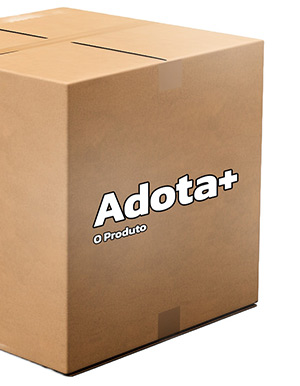
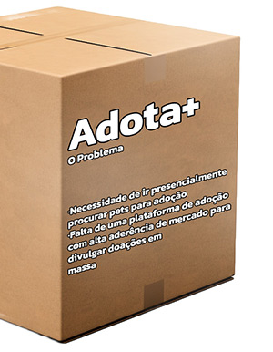
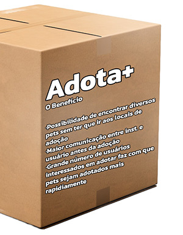

# Adota+ Elaboração de Roteiro de Entrevista e Questionário

###### Roteiro de Entrevista

* **Experiência com Animais de Abrigo:** Se você já adotou um pet de um abrigo, pode compartilhar sua experiência conosco? Como foi o processo de adoção?
* **Feedback sobre Aplicativos Existentes:** Se você já utilizou aplicativos de adoção de pets anteriormente, quais foram suas experiências com eles? O que funcionou bem e o que poderia ser melhorado?
* **Ideias para Melhoria:** Você tem alguma sugestão ou ideia para tornar o processo de adoção de pets mais eficiente ou mais agradável?
* **Disponibilidade para Adoção:** Você tem alguma restrição específica em relação à disponibilidade para adotar um pet? (Ex: tempo, espaço, alergias, etc.)
* **Conscientização sobre a Adoção:** Qual é a sua opinião sobre a importância de conscientizar as pessoas sobre a adoção de pets em vez de comprar animais de estimação de criadores?

###### Questionário

**Experiência com Pets:** Você atualmente tem algum animal de estimação?

* [ ] Sim
* [ ] Nao

**Motivação para Adoção:** Qual é o principal motivo que o leva a considerar a adoção de um pet?

* [ ] Companhia
* [ ] Amor pelos animais
* [ ] Contribuir para a redução do abandono de animais
* [ ] Outro: __________

**Preferência de Comunicação:** Qual é sua preferência de comunicação para receber atualizações sobre pets disponíveis para adoção?

* [ ] Notificações push no aplicativo
* [ ] E-mails
* [ ] Mensagens de texto (SMS)
* [ ] Nenhuma preferência específica

###### Grupo

* Andrei Santos de Oliveira
* Bruno Marques Freitas
* Caio Issao de Barros Fujisawa
* Samuel Pereira Barreto
