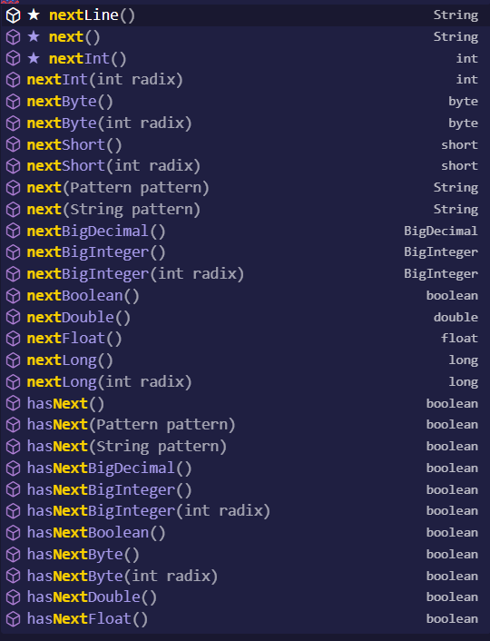

classe scanner, tipo input..

1. import java.util.Scanner;
2. criar objeto da classe scanner:
   1. Scanner console = new Scanner(System.in);
3. int n1 = console.nextInt();
   1. 
4. Fecha o bagui:
   1. console.close();
5. Exemplo:
6. ```java
   import java.util.Scanner;

   public class scan {
     public static void main(String[] args) {
       // cria variável console do tipo Scanner, como instância da classe Scanner
       // (classe e tipo tem mesmo nome n sei pq)
       Scanner console = new Scanner(System.in);

       // escaneando
       System.out.print("int: ");
       int n1 = console.nextInt();

       System.out.print("float: ");
       float n2 = console.nextFloat();

       System.out.print("string 1: ");
       String s1 = console.next();

       // usar depois de pegar string, limpar buffer
       console.nextLine();

       System.out.print("string 2: ");
       String s2 = console.nextLine();

       // fecha o bagui
       console.close();

       // exibe na tela
       System.out.printf("\n%d, %.2f, %s, %s", n1, n2, s1, s2);
     }
   }

   ```
